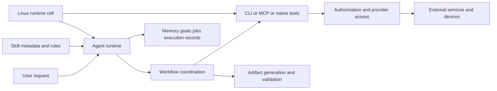

# 仓库总览

[总目录](README.md)

## 定位与基线

本仓库以原运行环境路径保留材料，而不是按可构建应用的源码布局组织。`home/hatch` 对应原 Agent 的 home，`opt/hatch` 是工具与技能包，`opt/hatch-image` 是镜像侧依赖。原文中的 `~`、`/run`、`/etc` 均不能直接套到读者的电脑。

本地基线提交为 `61121abf5c4da12fe32ef970a861108b16a0731b`。上游与本地 [README](../../README.md) 将其定位为不完整快照；本报告不认证其产品归属、线上模型或官方授权。产品说明中的外部事实仅按材料自述记录。

## 规模与口径

| 区域 | Git 跟踪路径数 | 主要内容 |
|---|---:|---|
| 根文件 | 6 | 双语 README、旧分析、校验与 Git 属性 |
| `home/hatch` | 31 | 26 份产品说明、配置和历史审计 |
| `opt/hatch/skills` | 214 | 68 独立技能、别名、参考、权限、评测和 HTML |
| `opt/hatch/runtime-cell` | 22 | Shell 生命周期及环境配置 |
| `opt/hatch/bin` | 77 | 本地实际内容均为 ELF |
| `opt/hatch-image/bin` | 2,308 | 其中 npm-package 为 2,269 路径 |
| 合计 | 2,658 | 含符号链接，不含本次新增报告 |

72 个 SKILL.md 路径含 68 普通文件与 4 个别名。40 个 manifest 路径含 38 独立文件与 2 个别名；12 份 eval YAML 是场景规格。不能把 skill 数、connector 数、available 条目数与工具数量混为一谈。

旧报告用原始存档的普通文件/硬链接口径；当前报告使用 Git 跟踪路径口径。Git 不保存硬链接关系，旧报告“17 个程序共享 inode”的观察不能直接推广到新 checkout。

## 可见系统的职责分解

图是依据可见契约整理的职责图，不是从核心源码提取的完整调用图。实线表达文档描述的依赖关系，不能据此推断所有实现都位于同一进程。

技能主要是操作协议：何时触发、如何定位对象、如何使用工具、什么情况下停止、怎样验收。真正访问网络、处理 OAuth、进行支付或执行数据库查询的代码多数在 ELF 或远端服务中。例外是可读 Shell、Python 转换器、静态 HTML 及 npm 工具源。

## 最值得复用的部分

1. 分开记录候选决策、事实证据和供应商执行状态，见 [Travel Planning](skills/travel-planning.md)。
2. 将命令映射到方法权限，再由方法覆盖组默认，见 [Gmail](skills/gmail.md)。
3. 从工具结果保持账户和资源身份，不凭名字重建定位，见 [Calendar](skills/google-calendar.md)。
4. 非幂等写入超时先查结果，不自动重试，见 [Booking](skills/booking.md)。
5. 删除未来生产者和衍生索引，才能完成记忆遗忘，见 [Forget](skills/forget.md)。
6. 渲染后验收交付物，而不是仅看生成程序退出码，见 [Artifacts Testing](skills/artifacts/testing.md)。

## 不能由快照证明的部分

没有可读完整加载器，无法确认技能排名算法、缓存策略、token 裁剪或冲突优先级。没有完整权限执行器，不能认证所有 API 方法都映射正确。缺 rootfs、服务单元和平台基础设施，无法本地独立复现系统。缺测量结果，不能推断性能、成本与生产可靠性。

这些限制不是否认文档设计价值，而是决定开发时哪些约束需要重新实现并验证。
