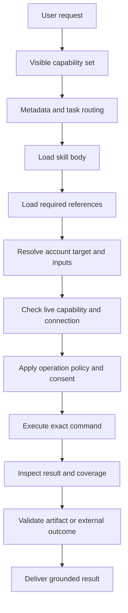

# 系统如何选择和使用技能

[总目录](README.md)

## 结论与可见性限制

可见文件支持“运行环境先形成可见能力集合，Agent 根据元数据和任务规则选择，再按需读正文/参考并调用工具”的工作方式。**仓库没有完整技能加载器或选择器源码**，不能确认采用向量检索、关键词匹配、特定排序算法或固定数量的候选。

本章把能直接证明的步骤与仍未知的步骤分开。关键来源：[skill-creator](../../opt/hatch/skills/skill-creator/SKILL.md)、[技能配置](../../home/hatch/config/skills.yaml)、[渠道脚本](../../opt/hatch/runtime-cell/launch-daemon.sh)、[数据库契约](../../opt/hatch/skills/muse_db/references/schema.md)。

## 第一层：运行环境可见集合

`launch-daemon.sh` 按 `JARVIS_CD_CHANNEL` 读取 `skill-scopes.conf`，把匹配的 host-only scoped 目录 overlay 到暴露的 base tree。未知渠道不添加 scoped 技能；额外挂载失败回 base。这是 Shell 可直接证明的代码路径。脚本注释还要求 revealed skill 具备 extensions_scoped 的 acceptance 条目；对应加载器不在快照，文件可见仍不等于完整启用。

`bin-scopes.conf` 独立决定工具程序暴露。**skill 可见不保证所需 binary 可见**；两条轴没有随包的完整构建期一致性验证。与此同时，隐藏 binary 也不是底层授权本身。

当前快照主要保留 `/opt/hatch/skills`，没有 scoped 全集，不能用 scopes 文件里的名字推断那些技能具体做什么。

## 第二层：可用性声明与入口描述

`home/hatch/config/skills.yaml` 有 31 个 available 条目，主要对应连接器。它不是全部 68 个技能的注册表，更不是 OAuth token、账户连接或用户授权记录。未列入的 workflow 技能不能因此认定禁用。

多数 frontmatter 包含 name、description、metadata.includeInPrompt；部分另有 icon、title、allowed-tools、devices、voiceOnly。这些字段可以提供触发和上下文过滤信息，但确切解析、默认值与执行语义缺源码。尤其：

- `includeInPrompt=false` 不能解释为无法选择；多个格式技能通过上层 workflow 明确要求读取。
- `allowed-tools` 出现在 Duffel 正文，不证明其他工具在运行时被强制禁止。
- `devices` 是设备适用性声明，不等于实时设备能力；设备工具仍需 describe。
- `voiceOnly` 与目录别名不能创建新的用户能力。

## 第三层：语义分流规则

| 用户意图 | 首要入口 | 进一步分支 | 不应混淆的边界 |
|---|---|---|---|
| 多日旅行安排、可行性、转机 | travel-planning | booking 的有界 live check | 查价不等于授权预订 |
| 已明确对象的实时预订 | booking | duffel、opentable、ticketmaster、官网 | 供应商手册不是整体交易协调者 |
| 航班时刻、延误、取消 | flightaware | 精确 dated leg | 不走购票工作流 |
| 商品发现或购买 | shopping | catalog、browser、Marketplace、UCP | 自有 listing 管理归 Facebook |
| 本人 Instagram 内容 | instagram | content questions | 私信需要另一 connector |
| 原文朗读 | tts | speak / synthesize-script | 编写新内容归 generate_podcast |
| 创建目标 | goals | creation/category | 已有目标跟进不重做 intake |
| 遗忘个人信息 | forget | plan → confirm | “算了”取消任务不一定是遗忘 |
| 生成文件 | artifacts 对应类型 | references → testing | 写文件成功不等于交付合格 |
| 调设备功能 | wearable-device-skills | list → describe → invoke | 静态文档不能替代实时 schema |

这些优先级来自明确文本规则，并非推测的排序分数。应先确定任务的业务阶段，再匹配功能词。一个请求可以需要多个技能，但必须有一个当前决策的负责人。

## 第四层：按需加载

skill-creator 要求主文件只保留核心，把长文、模式和示例放 references。travel-planning 按启动、行程细化、事实核验和预订交接分文件；Facebook 按功能域拆分；Artifacts 按格式及创建/编辑路径选择。

Goals 是不同入口携带上下文的具体例子：Goals 页已注入某类别完整创建契约时不再读文件；普通对话创建需要主动读；已存在目标只读 scaffold。说明“总是加载全部文件”会改变实际工作流并浪费上下文。[证据](../../opt/hatch/skills/goals/SKILL.md)

## 第五层：从规则进入工具执行

除渠道暴露的脚本外，该图是文档要求的概念流程，不声明运行时全部阶段各有独立组件。Peloton 普通读可先调用再处理连接错误；无需强迫每个技能机械遵循同样 preflight。

## 跨技能交接的必要字段

好的交接不是“帮我订票”。Travel Planning 的 handoff 至少保留 trip posture、候选及决策状态、精确行程、人数、硬限制、预算和证据。live result 与原签名不符要返回规划，不能静默改日期、机场或舱位。

购物从商品发现到 checkout 要保留 product ID、真实 URL、eligibility flags 和 runtime telemetry context。Docs/Slides 发布要保留 artifact 文件和远端 ID，Sheets 则局部调用 API。不同技能共享工具并不代表可互换流程。

## 缓存、失效与未知

schema 中出现 `runtime.skill_invalidation_state`，可以证明系统数据契约包含技能失效状态，但不能据一张表推出缓存算法、刷新触发顺序或性能特征。用户 workspace skills 的扫描合并顺序、别名去重、同名冲突处理、提示词裁剪和模型内选择逻辑仍未知。

开发其他仓库时应显式定义这些行为，不能把本报告的概念流程当成缺失源码的精确复刻。最小实现见 [开发指引](08-development-guide.md)。
