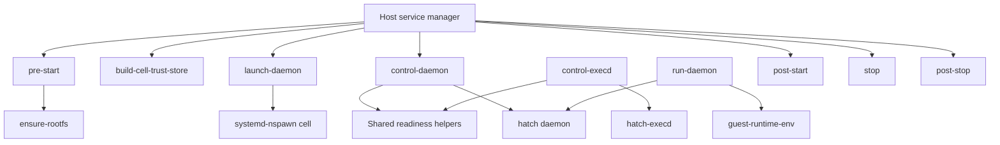

# 运行时与隔离

[返回目录](README.md) · [27 个文件详解](runtime/README.md)

## 目录

[启动关系](#启动关系) · [阶段职责](#阶段职责) · [持久状态](#持久状态) · [隔离与凭据](#隔离与凭据) · [停机恢复](#停机恢复) · [复用边界](#复用边界)

## 启动关系

可见代码是一套 Linux 宿主与 runtime cell 的边界脚本，不是可在当前 macOS 上直接启动的应用。它依赖宿主目录、rootfs 镜像、权限分离控制服务和随包 ELF。systemd unit、完整镜像构建与核心服务源码未全部提供。

下图整理文本中可见的入口和职责；Manager 表示外部编排依赖，并非本仓库提供了完整 unit 定义。外部服务管理器的完整 ordering 未知。尤其不能根据陈旧注释，把 `control-daemon` 画成调用 `run-daemon`。

`control-daemon` 当前末尾直接 exec `hatch daemon --runtime-cell-leader`。上图将 `run-daemon` 保留为仓库仍存在的入口，不认定它处于主启动链。

## 阶段职责

| 阶段 | 可见实现 | 重点约束 |
|---|---|---|
| 宿主能力 | [require-modules](runtime/require-modules.md) | 检查所需内核能力；当前机器通过语法不证明 Linux 可运行 |
| 根文件系统 | [resolve-rootfs](runtime/resolve-rootfs-path.md)、[ensure-rootfs](runtime/ensure-rootfs.md) | 固定路径契约、digest、btrfs 或 overlay、宿主 FS 操作权限 |
| 启动准备 | [pre-start](runtime/pre-start.md) | 目录、网络、DNS、挂载、运行凭据和环境准备；具备宿主副作用 |
| 信任材料 | [build-cell-trust-store](runtime/build-cell-trust-store.md) | 宿主 staging 构建；只读分发；避免 cell 改动宿主信任源 |
| 进程入口 | [launch-daemon](runtime/launch-daemon.md)、[runtime-cell-entry](runtime/runtime-cell-entry.md) | channel 条件文件投影，leader 发现，命名空间入口 |
| 入口包装 | [control-daemon](runtime/control-daemon.md)、[control-execd](runtime/control-execd.md)、[run-daemon](runtime/run-daemon.md) | 各自校验和环境转交不能以名称类推为同一入口 |
| 启动后协调 | [post-start](runtime/post-start.md)、[hatch-preflight](runtime/hatch-preflight-opportunistic.md) | 状态确认、OS intent replay 和非致命启动检查 |
| 停机 | [stop](runtime/stop.md)、[post-stop](runtime/post-stop.md) | 有序停服务、回收进程和网络；重复调用的清理策略 |
| 环境定义 | [guest-runtime-env](runtime/guest-runtime-env.md)、[guest.env](runtime/guest.env.md)、[etc](runtime/README.md) | guest 内的变量、用户名与 DNS 不是宿主默认配置 |
| 镜像补充 | [runtime-cell.kdl](runtime/image/runtime-cell.kdl.md)、[prewarm](runtime/image/hatch-prewarm.md) | 进程启动配置和性能预热；不是业务路由 |

## 持久状态

### rootfs 更新

`ensure-rootfs` 对已知状态和目标 digest 做判断，不匹配时可删除重建 serving rootfs。这是原部署管理行为，不应作为通用“修复路径”直接在开发者机器执行。btrfs snapshot 和 overlay 路径的文件系统语义不同，复用前需保留各自测试。

UID/GID 131072 的哨兵 stat 能发现某些布局错误，但不能证明全树无错误所有权。目录安全还依赖宿主 FS 操作器；其内部没有可读源码。本报告只核对 shell 传参和控制流，不据此认证宿主隔离。

### 软件包意图

[convert-cell-intent](runtime/image/convert-cell-intent.md) 从旧 rootfs 的 dpkg 状态得到已安装包集合，减去镜像基线的包名集合，向 `ledger.jsonl` 追加迁移事件。它记录包名，不保持用户旧版本的 pin。已有 done marker 时直接退出。

迁移先追加 ledger，再写快照和 done marker。中途崩溃可能重复追加，代码选择可重放重复而非丢失意图。atomic rename 不等于断电持久保证；没有 fsync 和并发锁。调用者是否保证单写者是独立前提。

[preflight](runtime/hatch-preflight-opportunistic.md) 只打开一次 ledger，使用 `O_NOFOLLOW`、`O_NONBLOCK` 与 fstat 检查；限制保留内容与哈希读取预算，避免 FIFO、链接和巨文件拖住启动。失败摘要参与重试抑制，迁移之后重新快照。shell 对 JSON 的处理仅支持其实际格式，不能推广成通用 JSON 解析器。

preflight 的最终 exit 0 是启动可继续的策略，不是所有包都安装成功。迁移日志、applied marker 和业务使用仍需各自验证。

## 隔离与凭据

`skill-scopes` 决定条件 skill 文件；`bin-scopes` 决定另一组 CLI 可见性。它们解决分发与可见面，不代表授权全貌。宿主权限分离 worker 可能使用 cell 中不可见的工具，因此“没有某 binary”不能证明整个系统无法执行该能力。

`guest-runtime-env` 和各入口脚本建立受控环境。信任库先在宿主 staging 生成，再通过只读边界提供给 guest。NSS 文件用 rename 替换是逐文件原子，不是目录级事务；读取者对多文件一致性的要求需另验。

浏览器、authd、网络代理及私有凭据的真实授权逻辑主要在二进制中。产品隐私说明描述目标行为，但没有完整源码和原环境运行测试，不能断言所有命名空间、进程生命周期和密钥访问路径已验证安全。

## 停机恢复

停机脚本包含等待、进程控制与网络清理，必须放在宿主服务管理的整体 ordering 中理解。没有对应 unit 的依赖关系，就不能断言任何入口在任意顺序调用都安全。恢复测试需要覆盖中途失败、leader 退出、重复 stop、残留 mount 和缺服务。

静态发现：`rce_runtime_cell_leader` 拒绝空值和 0；`rce_wait_for_ready_leader` 对另一条路径只检查空值。两者条件不一致。它是否形成可达错误要看 `hatch runtime-cell leader` 的返回约定，本文列为需要集成验证的问题，不声明已复现漏洞。

预热器有预算与超时，区分宿主可信 ELF 和 daemon bundle 的检查方式；它不能证明启动耗时改善。应先测冷启动和页缓存命中，再决定是否迁移这一优化。

## 复用边界

通常只需借鉴显式阶段、状态文件契约、限定重试和安全入口。只有目标仓库真的运行不可信本地代码、且已有隔离运维能力时，才考虑移植 cell。纯服务端技能路由不需要整套 mount/network/rootfs 生命周期。

本次只做静态语法及 Python 离线样例检查。没有执行这些宿主启动脚本，具体结果见[验证记录](09-validation.md)。
